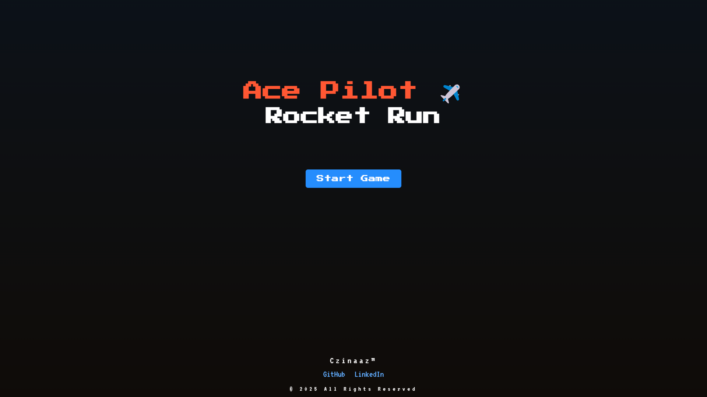
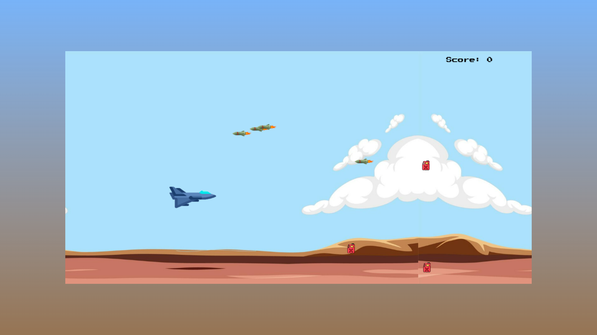

# Ace Pilot ✈️ Rocket Run
Welcome to Ace Pilot ✈️ Rocket Run, an exciting, action-packed game where you take on the role of a skilled pilot navigating through enemy rockets. Dodge obstacles, collect bonuses, and aim for the highest score in this thrilling rocket-fueled adventure.

# 🚀 Game Features
Dynamic Gameplay: Navigate your rocket through various obstacles and enemies.
High Score Tracking: Compete with yourself to beat your high score.

# 🎮 How to Play
Start the Game: Click the Start button on the main menu.
Control the Rocket: Use your keyboard to move your rocket around the screen.
Arrow keys to navigate
Avoid Obstacles: Dodge incoming obstacles and enemies to stay alive.
Collect Bonuses: Grab power-ups to boost your performance.
Goal: Survive as long as you can while scoring points.

# 🌟 Installation
To get started with the Ace Pilot ✈️ Rocket Run game on your local machine, follow these simple steps:

Clone the repository:
bash

git clone https://github.com/Czinaaz/ace-pilot-rocket-run.git
Navigate to the project directory:
bash

cd ace-pilot-rocket-run
Open the index.html file in your web browser to start playing the game.

# ⚙️ Technologies Used
HTML: Structure of the game.
CSS: Styling and design.
JavaScript: Game logic and functionality.
Canvas API: Drawing the game objects and handling animations.
Git: Version control for code management.

# 👾 Contributing
We welcome contributions to improve the game! If you'd like to contribute, please fork the repository, create a branch, and submit a pull request with your changes. Here's how you can contribute:

Fork the repository.
Create a new branch for your feature or fix.
Commit your changes and push them to your fork.
Open a pull request for review.

 # 📝 Acknowledgments
Inspired by my last game project: Game Goose [pygame](https://github.com/Czinaaz/pygame) built in Python. It has the same mechanics and gameplay. Built-in JavaScript so you can play it from the repository or link.
Huge shoutout to OpenAI for their support in developing this project.

# Enjoy flying the Ace Pilot ✈️ Rocket Run! 
